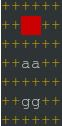
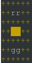
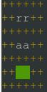

# LinuxTrafficSignals
North American traffic signals with ncurses on Linux.





## Build
First create a build directory from project root and go into it:
```
$ mkdir build && cd build
```
Then build the code just enter:
```
$ cmake .. && make
```

## Run
To run the built program in the build directory do:
```
$ ./lts
```
And to exit just hit any key.
